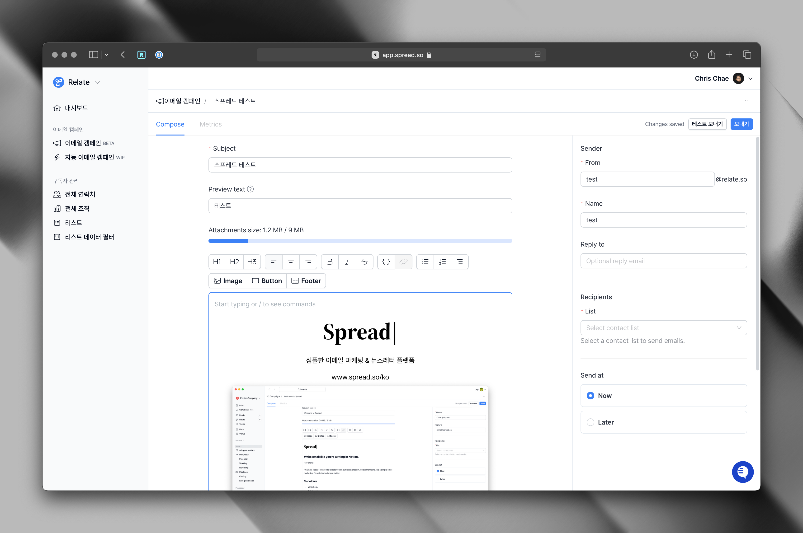

## Overview

스프레드를 통해 첫 이메일을 보내는 방법을 알아봅니다.

## 보내기 전 체크리스트

스프레드를 통해 이메일을 보내기 전에 알아야 할 중요한 사항을 확인 해주세요.

1. **이메일은 구독자의 받은편지함으로 가지지 않으면, 무용지물입니다.** 스프레드 팀의 우선순위는 늘 안정적인 이메일 전달에 있습니다. 따라서 스프레드는 “low-html/css” 이메일 방식을 사용합니다. 
2. **기존의 이메일 대량발송 서비스들과 다르게 스프레드는 이메일을 보낼 때 최소한의 스타일링을 적용하여 이메일이 구글, 네이버 등 서비스들의 스팸 또는 홍보편지함으로 (최대한) 빠지지 않도록 하고 있습니다.**
3. **스프레드를 통해 콜드 메일을 보내지 마세요!** 동의 하지 않은 사람들에게 대량발송을 통한 이메일 전송은 법적으로 금지되어 있기도 하고, 나의 도메인 평판이 망가져서 다시는 이메일을 정상적으로 보내지 못하게 될 위험도 있습니다.
4. 발송 대상 구독자가 수 천, 수 만명인데 지난 몇 개월 동안 이메일을 보내지 않았다면, 이메일을 보내기 전에 사전 웜업 및 클리닝 작업이 필요합니다. 관련 내용은 [리스트 관리 페이지](/manage-lists)를 확인하세요.
5. 이메일 작성 시에도 스팸 필터 알고리즘에 걸릴 수 있는 "무료", "할인", "특별", "혜택" 등의 키워드를 필요시에만 사용하고, 일반적으로는 사용하지 않도록 합니다.


<Accordion title="콜드 메일을 보내려면 어떻게 해야 하나요?">

스프레드는 콜드메일을 위한 서비스가 아니기에 스프레드를 통해 콜드메일을 보내는 것을 권장하지 않습니다. 

콜드 메일을 보내는 가장 안정적인 방법은 스프레드의 자매 서비스인 Relate의 [Engage](https://www.relate.kr/engage)을 활용하는 것입니다.
</Accordion>

## Basics

### 1. 이메일 작성하기

스프레드 앱내 왼쪽 메뉴 하단에서 **이메일 캠페인**을 통해 캠페인 페이지에 진입합니다. 이후, 상단의 `+ 캠페인`을 누르면 새로운 캠페인을 만들 수 있습니다.



이메일 캠페인 작성시 다음 내용을 채워주세요.

- Subject: 이메일 제목
- Preview: (선택) 프리뷰 텍스트는 고객의 받은 편지함에서 제목 다음으로 보이는 한 줄 설명입니다. 이메일 내용을 요약하거나 핵심 주제나 혜택을 강조하는 등의 내용을 작성할 수 있습니다.

#### 이메일 본문 작성하기

스프레드에는 노션에서 글을 쓰듯 이메일을 작성할 수 있는 에디터가 있습니다. 에디터 상단에 있는 툴바를 사용해서 텍스트에 다양한 스타일 적용이 가능하고, 이미지 추가/리사이징/위치 조정도 가능합니다. 툴바를 직접 선택하지 않더라도, 에디터에서 /를 입력하면 텍스트 스타일링, 버튼 및 이미지 추가 메뉴를 확인할 수 있습니다.

마지막으로, 버튼을 활용해 Call-to-action(CTA) 요소도 추가할 수 있습니다. 만약 버튼이나 별도의 하이퍼링크 및 링크가 포함된 경우, 발송 후 [Metrics](/metrics)에서 이메일 오픈 및 링크별 클릭 여부 확인이 가능합니다.

#### 이메일 Footer 내용 설정

스프레드는 모든 이메일에 Footer를 붙여서 보내는 것을 권장하고 있습니다. Footer 내용은 캠페인 별로 설정할 수 있고, 기본적으로 설정된 내용은 다음과 같습니다.

- 구독자가 이 이메일을 수신한 경로 및 이유
- 회사 이름
- 회사 주소
- 구독자가 직접 수신거부 및 구독취소를 할 수 있는 수신거부 버튼

예시:

```
이 이메일을 받으셨다면, 스프레드 뉴스레터 구독에 동의하신 것입니다.
Spread, 6 Jong-ro 6th Floor, Seoul, Republic of Korea
[[수신거부]]
```

스프레드에서는 자유 형식으로 회사 이름과 회사 주소 등을 입력하게 되어 있습니다. 일반적으로, 회사 이름 > 회사 주소 순서를 따릅니다. 위의 예시를 참고해주세요.

#### 수신거부 링크 커스텀 설정하기

수신거부 링크는 캠페인 별로 설정할 수 있습니다. 어떤 텍스트든 `[[여기에 텍스트 입력하세요]]` 형식으로 대괄호를 두번씩 감싸면 수신거부 링크로 인식합니다.

<Info>
수신 거부(Unsubscribe)는 테스트 발송(Test send)에서는 사용할 수 없으나, 실제 발송시에는 원활하게 이루어지고 있습니다. 관련한 문의 사항이 있다면 we@relate.so 로 문의해주세요.
</Info>

### 2. 발신자 정보 설정하기

발신자 정보는 이메일 캠페인 별로 설정할 수 있습니다.

**Sender**
- From: 발신자 이메일 주소를 입력하세요.
- Name: 발신자 이름을 입력하세요.
- Reply-To: 구독자로부터 답장을 받을 이메일 주소를 입력하세요. 만약 발신자 이메일과 동일하다면, 비워두면 됩니다.

### 3. Recipients (수신자) 정보 설정하기

이메일 캠페인을 보내고자 하는 리스트를 선택해주세요. 만약 리스트가 아직 없다면, 먼저 [리스트 관리 페이지](/manage-lists)에서 리스트를 만드셔야 캠페인을 보낼 수 있습니다.

### 4. 이메일 발송 예약하기 (선택)

이메일 발송 예약은 현재 시간 이후 발송 시간을 선택할 수 있습니다. 바로 발송하고 싶다면, `Now`를 선택해주시면 됩니다.

### 5. Powered by Spread 브랜딩 제거하는 법

`Powered by Spread`는 유료 플랜에서만 제거할 수 있습니다. 이곳에서 [플랜 변경](https://admin.spread.so/settings/billing)을 시작하실 수 있습니다.